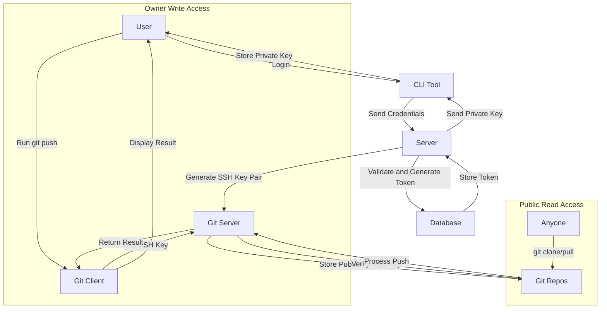

# MERGIT is a OpenSource Git Hosting Service

## This project is a Git hosting service, similar to GitHub, providing a robust ecosystem and tools for managing repositories, SSH keys, and user authentication.

### Tech Stack 
 - golang
 - Typescript
 - ejs | Mustash ( can be changed accordingly )
 - shell
 - libsql | turso | sqlite
 - SSO | OAuth
 - etc..

### Under Construction

This Git hosting service is currently under development. We are working to build a comprehensive ecosystem similar to GitHub, with unique tools and features. Contributions from the community are highly appreciated.

### Contact

If you would like to contribute or have any questions, please contact us at:

Email: akshatkot@gmail.com

